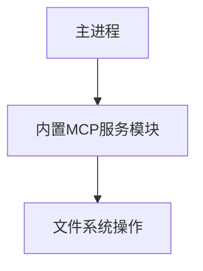

# MCP服务器集成方案

## 目标
将MCP服务器功能集成到主进程中，消除独立进程带来的复杂性

## 当前架构问题
1. 需要手动启动MCP服务器进程
2. 通过HTTP通信增加延迟和复杂性
3. 进程管理复杂(崩溃恢复、端口冲突等)

## 新架构设计


## 详细变更

### 1. 新模块创建: backend/mcp-service.js
```javascript
const fs = require('fs').promises;
const path = require('path');

class MCPService {
  constructor(novelPath) {
    this.novelPath = novelPath;
  }

  async writeFile(args) {
    const filePath = path.join(this.novelPath, args.path);
    await fs.writeFile(filePath, args.content);
    return { success: true };
  }

  async readFile(args) {
    const filePath = path.join(this.novelPath, args.path);
    const content = await fs.readFile(filePath, 'utf-8');
    return { content };
  }
}

module.exports = MCPService;
```

### 2. service-registry.js修改
```diff
- const { MCPClient } = require('./mcp-client');
+ const MCPService = require('./mcp-service');

 async function initializeServices() {
   // ...
-  const filesystemClient = new MCPClient('filesystem');
+  const filesystemClient = new MCPService(path.join(process.cwd(), 'novel'));
```

### 3. 文件删除
- 移除mcp-client.js
- 移除mcp-services目录

## 兼容性保证
1
2
2
2
2. 相同的返回数据结构
3. 相同的错误处理方式

## 测试计划
1. 文件读写功能测试
2. 工具调用链测试
3. 前端交互测试