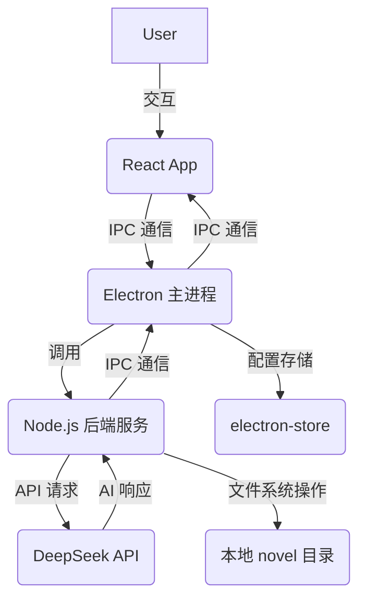

# AI小说家 MVP v1.1.0

[English Version](README_en.md) | 中文版


## 项目介绍

AI小说家 是一个基于 Electron 框架构建的桌面应用程序，旨在为用户提供一个AI辅助小说创作的平台。通过集成AI技术，帮助作者提升写作效率，激发创作灵感，并更有效地管理小说结构和内容。（这是完整构想，目前只实现基础功能，后续会进一步完善）

**核心功能**:
*   **AI 智能交互**: 与AI进行实时对话，获取写作建议、角色设定、情节发展等方面的智能辅助，也可以让AI直接自行写作并将内容保存到本地文件。
*   **章节管理**: 用户/AI直观地创建、编辑、删除和组织小说的章节，清晰呈现作品结构。
*   **内容编辑器**: 提供基础的文本编辑界面，支持小说内容的撰写和修改。
*   **本地数据存储**: 小说内容安全地存储在本地文件系统，确保数据隐私和离线可用性。
*   **差异编辑**: 引入差异算法，直观地展示和管理文本的修改。
*   **多标签页**: 支持多标签页功能，方便在不同章节和文档间切换。
*   **回溯功能**: 提供版本控制能力，可以轻松回溯到之前的某个版本。

## 技术栈

*   **Electron**: 用于构建跨平台的桌面应用程序，结合了Web技术（HTML、CSS、JavaScript）和原生能力。
*   **React.js**: 前端用户界面框架，提供高效的组件化开发模式和出色的用户体验。
*   **Node.js**: 后端服务运行时环境，负责处理与AI的交互、文件系统操作以及与前端的IPC通信。
*   **AI API集成**: 目前已统一集成DeepSeek-v3和DeepSeek-r1模型API，实验性支持本地Ollama模型（存在较多适配问题）。
*   **Redux**: 前端状态管理库，用于统一管理应用程序的复杂状态。
*   **Tiptap**: 优秀的富文本编辑器。
*   **electron-store**: 轻量级的Electron配置存储库，用于持久化应用程序设置，例如API Key。

## 特性

*   **AI 聊天交互**: 用户可以通过聊天界面与AI进行自然语言交流，请求AI生成文本、续写段落、提出创意、对现有内容进行修改和润色，能够帮助作者打破创作瓶颈，快速构思新的故事情节。
*   **章节管理**: 应用提供一个树形结构的章节导航面板，允许用户创建新章节、重命名、删除等操作，方便高效地构建和维护小说的整体框架。
*   **内容编辑器**: 内置的编辑器提供了基本的文本编辑功能，未来考虑扩展更多高级编辑体验，以提升写作效率。
*   **本地文件存储**: 所有小说内容都存储在用户本地的 `novel` 目录下，确保数据的安全性和私密性。应用会实时监听 `novel` 目录的变化，自动更新章节树和内容。
*   **API Key 配置**: 用户可在设置界面配置DeepSeek API Key。
*   **自定义系统提示词**: 支持用户在设置中自定义AI的系统提示词，以更好地控制AI的响应风格和内容。

## 架构概览



## 快速开始

### 先决条件

*   Node.js (推荐 LTS 版本)
*   npm 或 yarn

### 安装

1.  **克隆仓库**:
    ```bash
    git clone git@github.com:18643751823/ai-novelist.git
    cd ai-novel
    ```

2.  **安装后端依赖**:
    在项目根目录 (`ai-novel/`) 下执行：
    ```bash
    npm install
    ```

3.  **安装前端依赖**:
    进入前端目录 (`ai-novel/frontend/react-app/`) 并执行：
    ```bash
    cd frontend/react-app
    npm install
    ```

### 运行应用
 **启动 Electron 应用**:
    项目根目录 (`ai-novel/`) 执行：
    ```bash
    npm run start:full .
    ```

 **配置 API Key**:
    应用启动后，您需要在应用的设置界面中输入您的 API Key。此API Key将通过 `electron-store` 进行安全存储。


## 贡献规则
- 所有代码提交必须包含 `Signed-off-by` 行（符合 [DCO](https://developercertificate.org/)）。
- 贡献者确认其代码依据 [MIT 协议](LICENSE) 授权。
- 所有代码必须是原创或兼容 MIT 协议，不可附加额外限制。
- 禁止引入 GPL/AGPL 等非兼容许可证的代码。

我们欢迎并感谢所有贡献者！如果您有任何 Bug 报告、功能建议或希望提交代码，请随时通过 GitHub Issues 或 Pull Requests 与我们联系。

## 许可证

本项目采用 [MIT 许可证](LICENSE)，所有贡献者需通过 DCO 签署。项目维护者有权将代码用于闭源商业产品，并保持开源版的维护。

**未来发展与版权管理**:
本项目旨在成为一个活跃的开源项目。我们鼓励所有形式的贡献，并致力于确保项目在 MIT 许可框架下的合法合规性。目前，所有贡献均视为按 MIT 许可证授权。然而，为了应对未来可能出现的商业化需求或更严格的知识产权管理，项目可能会考虑引入 **CLA (贡献者许可协议)**，以彻底规避潜在的法律风险。届时，我们将在 `CONTRIBUTING.md` 中提供详细的 CLA 政策和签署流程。


---

## 致谢 (Acknowledgements)

本项目的开发在很大程度上借鉴了 `roo-code` 项目。我们对 `roo-code` 的开发者们表示衷心的感谢。

`roo-code` 项目基于 Apache License 2.0 开源。根据其许可证要求，我们在项目中包含了其原始的许可证声明，您可以在 [`LICENSE-roo-code.txt`](./LICENSE-roo-code.txt) 文件中查看。

## Acknowledgements

This project is heavily inspired by and based on the work of the `roo-code` project. We extend our sincere gratitude to the developers of `roo-code`.

The `roo-code` project is licensed under the Apache License, Version 2.0. In compliance with its terms, we have included the original license notice within our project, which can be found in the [`LICENSE-roo-code.txt`](./LICENSE-roo-code.txt) file.