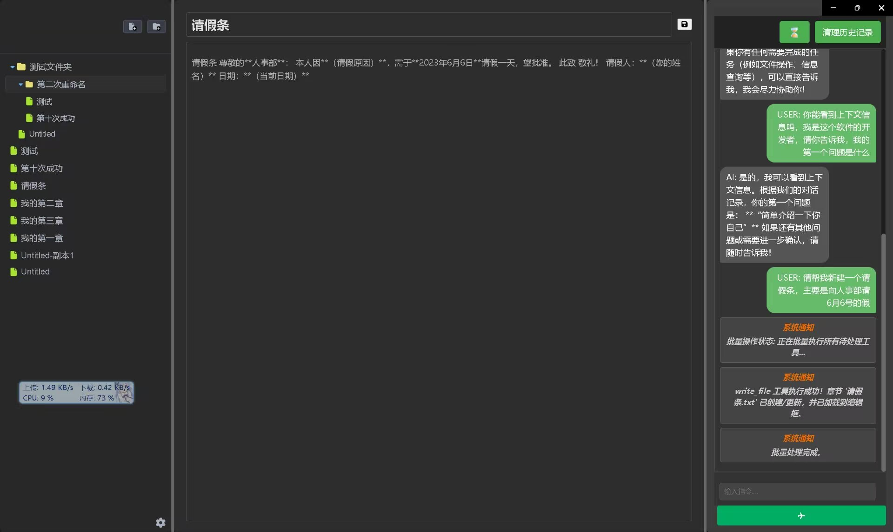
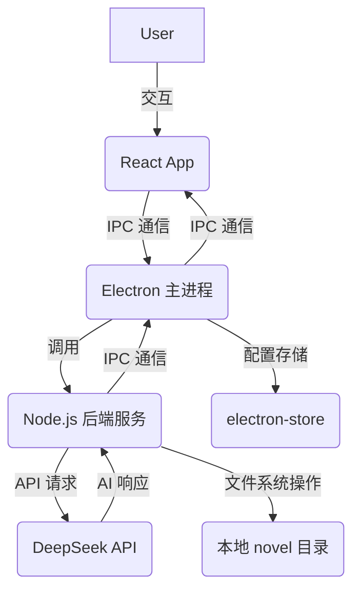

# AI小说家 MVP


## 项目介绍

AI小说家 是一个基于 Electron 框架构建的桌面应用程序，旨在为用户提供一个AI辅助小说创作的平台。通过集成AI技术，帮助作者提升写作效率，激发创作灵感，并更有效地管理小说结构和内容。（这是完整构想，目前只实现基础功能，后续会继续完善）

**核心功能**:
*   **AI 智能交互**: 与AI进行实时对话，获取写作建议、角色设定、情节发展等方面的智能辅助，也可以让ai直接自行写作并将内容保存到本地文件。
*   **章节管理**: 用户/ai直观地创建、编辑、删除和组织小说的章节，清晰呈现作品结构。
*   **内容编辑器**: 提供基础的文本编辑界面，支持小说内容的撰写和修改。（目前经常有焦点丢失问题）
*   **本地数据存储**: 小说内容安全地存储在本地文件系统，确保数据隐私和离线可用性。

## 技术栈

*   **Electron**: 用于构建跨平台的桌面应用程序，结合了Web技术（HTML、CSS、JavaScript）和原生能力。
*   **React.js**: 前端用户界面框架，提供高效的组件化开发模式和出色的用户体验。
*   **Node.js**: 后端服务运行时环境，负责处理与AI的交互、文件系统操作以及与前端的IPC通信。
*   **DeepSeek API**: 集成领先的AI模型，为用户提供智能对话和内容生成服务。以后考虑集成更多ai的api功能，以及支持本地模型。
*   **Redux**: 前端状态管理库，用于统一管理应用程序的复杂状态。
*   **Tiptap**: 优秀的富文本编辑器。
*   **electron-store**: 轻量级的Electron配置存储库，用于持久化应用程序设置，例如API Key。

## 特性

*   **AI 聊天交互**: 用户可以通过聊天界面与AI进行自然语言交流，请求AI生成文本、续写段落、提出创意、对现有内容进行修改和润色，能够帮助作者打破创作瓶颈，快速构思新的故事情节。
*   **章节管理**: 应用提供一个树形结构的章节导航面板，允许用户创建新章节、重命名、删除等操作，方便高效地构建和维护小说的整体框架。
*   **内容编辑器**: 内置的编辑器提供了基本的文本编辑功能，未来考虑扩展更多高级编辑体验，以提升写作效率。
*   **本地文件存储**: 所有小说内容都存储在用户本地的 `novel` 目录下，确保数据的安全性和私密性。应用会实时监听 `novel` 目录的变化，自动更新章节树和内容。
*   **API Key 配置**: 暂时只支持deepseek的API，只支持deepseek v3，后续会添加更多ai的api功能，以及支持本地模型

## 架构概览



## 快速开始

### 先决条件

*   Node.js (推荐 LTS 版本)
*   npm 或 yarn

### 安装

1.  **克隆仓库**:
    ```bash
    git clone git@github.com:18643751823/ai-novelist.git
    cd ai-novel
    ```

2.  **安装后端依赖**:
    在项目根目录 (`ai-novel/`) 下执行：
    ```bash
    npm install
    ```

3.  **安装前端依赖**:
    进入前端目录 (`ai-novel/frontend/react-app/`) 并执行：
    ```bash
    cd frontend/react-app
    npm install
    ```

### 运行应用

1.  **启动前端开发服务器 (可选，仅开发时使用)**:
    在 `ai-novel/frontend/react-app/` 目录下执行：
    ```bash
    npm start
    ```
    这将启动一个开发服务器，通常在 `http://localhost:3000`。

2.  **启动 Electron 应用**:
    然后回到项目根目录 (`ai-novel/`) 并执行：
    ```bash
    npm start # 或者 electron .
    ```
    这将启动桌面应用程序。

3.  **配置 DeepSeek API Key**:
    应用启动后，您需要在应用的设置界面中输入您的 DeepSeek API Key。此API Key将通过 `electron-store` 进行安全存储。

## 项目结构

```
ai-novel/
├── backend/                  # 后端服务代码，处理AI交互、文件操作等
│   ├── engine/               # 核心引擎逻辑
│   │   ├── api/              # AI API 接口 (deepseek.js)
│   │   ├── ipc/              # IPC 通信处理器
│   │   └── ...
│   └── tool-service/         # 工具服务定义与执行
├── frontend/                 # 前端应用代码
│   ├── mvp/                  # 早期前端原型 (如果存在)
│   └── react-app/            # React 前端应用
│       ├── public/           # 静态资源，包括 preload.js 和 Monaco Editor
│       ├── src/              # React 源代码
│       │   ├── components/   # UI 组件
│       │   ├── hooks/        # 自定义 Hook
│       │   ├── store/        # Redux 状态管理
│       │   └── ...
│       ├── package.json      # 前端依赖配置
│       └── README.md         # 前端项目的 README
├── main.js                   # Electron 主进程入口文件
├── package.json              # 项目主依赖配置 (Electron, 后端依赖等)
├── .gitignore                # Git 忽略文件配置
├── README.md                 # 本项目 README (您现在正在阅读的文件)
└── novel/                    # 存储小说内容的目录 (运行时自动创建)
```

## 贡献

我们欢迎并感谢所有贡献者！如果您有任何 Bug 报告、功能建议或希望提交代码，请随时通过 GitHub Issues 或 Pull Requests 与我们联系。

## 许可证

本项目采用 [MIT 许可证](LICENSE)。

**未来发展与贡献协议**:
本项目的目标是成为一个活跃的开源项目。我们鼓励所有形式的贡献。目前，所有贡献都将受到 MIT 许可证的保护。然而，如果项目未来获得商业投资或需要更严格的知识产权管理，我们可能会考虑引入 [CLA (贡献者许可协议)](CONTRIBUTING.md#cla-policy)。届时，我们将在 `CONTRIBUTING.md` 中提供详细的 CLA 政策和签署流程。