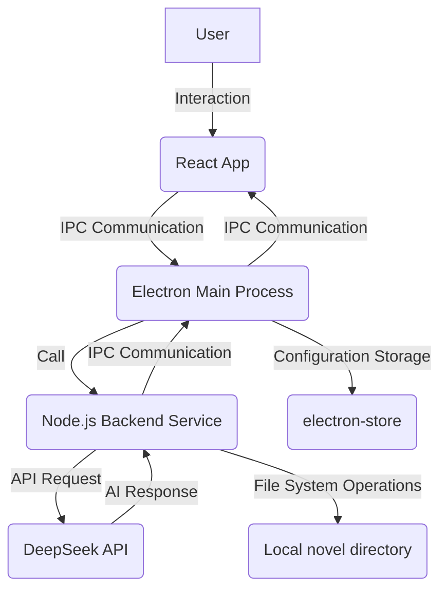

# AI Novelist MVP v1.1.0

[中文版](README.md) | English Version


## Project Introduction

AI Novelist is a desktop application built on the Electron framework, aiming to provide users with an AI-assisted novel creation platform. By integrating AI technology, it helps authors improve writing efficiency, stimulate creative inspiration, and manage novel structures and content more effectively. (This is the full vision; currently, only basic functions are implemented, and further improvements will be made later.)

**Core Features**:
*   **AI Smart Interaction**: Interact with AI in real-time to get intelligent assistance for writing suggestions, character settings, plot development, etc., and also allow AI to write directly and save content to local files.
*   **Chapter Management**: Users/AI can intuitively create, edit, delete, and organize novel chapters, clearly presenting the work's structure.
*   **Content Editor**: Provides a basic text editing interface, supporting the writing and modification of novel content.
*   **Local Data Storage**: Novel content is securely stored in the local file system, ensuring data privacy and offline availability.

## Technology Stack

*   **Electron**: Used to build cross-platform desktop applications, combining web technologies (HTML, CSS, JavaScript) with native capabilities.
*   **React.js**: Frontend user interface framework, providing efficient component-based development patterns and excellent user experience.
*   **Node.js**: Backend service runtime environment, responsible for handling AI interactions, file system operations, and IPC communication with the frontend.
*   **AI API Integration**: Currently supports unified integration of DeepSeek-v3 and DeepSeek-r1 model APIs.
*   **Ollama Support**: Experimental support for local Ollama models (with significant adaptation issues).
*   **Redux**: Frontend state management library, used to uniformly manage the application's complex state.
*   **Tiptap**: Excellent rich text editor.
*   **electron-store**: Lightweight Electron configuration storage library, used to persist application settings, such as API Keys.

## Features

*   **AI Chat Interaction**: Users can communicate with AI naturally through a chat interface, requesting AI to generate text, continue paragraphs, propose creative ideas, and revise and polish existing content, helping authors break through creative blocks and quickly conceive new story plots.
*   **Chapter Management**: The application provides a tree-structured chapter navigation panel, allowing users to create new chapters, rename, delete, and other operations, facilitating efficient construction and maintenance of the novel's overall framework.
*   **Content Editor**: The built-in editor provides basic text editing functions, with future plans to expand more advanced editing experiences to improve writing efficiency.
*   **Local File Storage**: All novel content is stored in the user's local `novel` directory, ensuring data security and privacy. The application monitors changes in the `novel` directory in real-time, automatically updating the chapter tree and content.
*   **API Key Configuration**: Users can configure DeepSeek API Key in the settings interface.
*   **Custom System Prompt**: Supports users customizing the AI's system prompt in settings to better control the AI's response style and content.

## Architecture Overview



## Quick Start

### Prerequisites

*   Node.js (LTS version recommended)
*   npm or yarn

### Installation

1.  **Clone the repository**:
    ```bash
    git clone git@github.com:18643751823/ai-novelist.git
    cd ai-novel
    ```

2.  **Install backend dependencies**:
    Execute in the project root directory (`ai-novel/`):
    ```bash
    npm install
    ```

3.  **Install frontend dependencies**:
    Navigate to the frontend directory (`ai-novel/frontend/react-app/`) and execute:
    ```bash
    cd frontend/react-app
    npm install
    ```

### Running the Application

1.  **Start the frontend development server (optional, for development only)**:
    Execute in the `ai-novel/frontend/react-app/` directory:
    ```bash
    npm start
    ```
    This will start a development server, usually at `http://localhost:3000`.

2.  **Start the Electron application**:
    Then go back to the project root directory (`ai-novel/`) and execute:
    ```bash
    npm start # Or electron .
    ```
    This will launch the desktop application.

3.  **Configure DeepSeek API Key**:
    After the application starts, you need to enter your DeepSeek API Key in the application's settings interface. This API Key will be securely stored via `electron-store`.

## Project Structure

```
ai-novel/
├── .gitignore                # Git ignore file configuration
├── CONTRIBUTING_en.md        # English Contribution Guidelines
├── CONTRIBUTING.md           # Contribution Guidelines
├── DeepSeek_API_说明.md      # DeepSeek API Description
├── LICENSE                   # Project License (MIT License)
├── main.js                   # Electron main process entry file
├── package-lock.json         # npm lock file, records dependency versions
├── package.json              # Project main dependency configuration (Electron, backend dependencies, etc.)
├── README_en.md              # English README (The file you are currently reading)
├── README.md                 # This project's README
├── request.json              # Request example file
├── Troubleshooting_Focus_Issues.md # Troubleshooting Focus Issues
├── Troubleshooting_Left_Panel_Layout.md # Troubleshooting Left Panel Layout
├── Troubleshooting_Rename_Input_Bug.md # Troubleshooting Rename Input Bug
├── backend/                  # Backend service code, handles AI interaction, file operations, etc.
│   ├── engine/               # Core engine logic
│   │   ├── api/              # AI API interface (deepseek.js)
│   │   ├── ipc/              # IPC communication handler (handlers.js)
│   │   ├── models/           # Model Management
│   │   │   ├── adapters/     # Model Adapters
│   │   │   │   ├── baseAdapter.js  # Base Adapter
│   │   │   │   ├── deepseekAdapter.js # DeepSeek Adapter
│   │   │   │   └── ollamaAdapter.js # Ollama Adapter
│   │   │   ├── modelProvider.js # Model Provider
│   │   │   └── modelRegistry.js # Model Registry
│   │   └── index.js          # Backend engine entry
│   ├── mcp-service.js        # MCP service
│   ├── service-registry.js   # Service registration
│   ├── state-manager.js      # State management
│   ├── tool-service/         # Tool service definition and execution
│   │   ├── tools/            # Specific tool implementations (definitions.js, executor.js)
│   │   └── index.js          # Tool service entry
│   └── utils/                # Utility functions
│       ├── file-tree-builder.js # File tree builder
│       └── logger.js         # Logger utility
├── frontend/                 # Frontend application code
│   └── react-app/            # React frontend application
│       ├── .gitignore
│       ├── Frontend_Refactoring_Plan.md # Frontend Refactoring Plan
│       ├── package.json      # Frontend dependency configuration
│       ├── README.md         # Frontend project's README
│       ├── public/           # Static resources
│       │   ├── favicon.ico
│       │   ├── index.html
│       │   └── preload.js
│       ├── src/              # React source code
│       │   ├── App.css
│       │   ├── App.js
│       │   ├── index.css
│       │   ├── index.js
│       │   ├── components/   # UI Components
│       │   │   ├── ChapterTreePanel.css
│       │   │   ├── ChapterTreePanel.js
│       │   │   ├── ChatHistoryPanel.css
│       │   │   ├── ChatHistoryPanel.js
│       │   │   ├── ChatPanel.css
│       │   │   ├── ChatPanel.js
│       │   │   ├── CombinedIcon.css
│       │   │   ├── CombinedIcon.js
│       │   │   ├── ConfirmationModal.js # Confirmation Modal
│       │   │   ├── ContextMenu.css
│       │   │   ├── ContextMenu.js
│       │   │   ├── EditorPanel.css
│       │   │   ├── EditorPanel.js
│       │   │   ├── LayoutComponent.js
│       │   │   ├── NotificationModal.css # Notification Modal Styles
│       │   │   └── NotificationModal.js # Notification Modal
│       │   ├── hooks/        # Custom Hooks (useIpcRenderer.js)
│       │   ├── ipc/          # IPC Communication
│       │   │   └── mainIpcHandler.js # Main Process IPC Handler
│       │   └── store/        # Redux State Management
│       │       ├── slices/   # Redux Slices (chatSlice.js, novelSlice.js)
│       │       └── index.js  # Store configuration
├── images/                   # Image resources
│   └── 示例图片.jpg          # Example image
└── novel/                    # Directory for storing novel content (created automatically at runtime)
```

## Contribution Rules
- All code commits must include a `Signed-off-by` line (in compliance with [DCO](https://developercertificate.org/)).
- Contributors confirm that their code is licensed under the [MIT License](LICENSE).
- All code must be original or compatible with the MIT License, without additional restrictions.
- Introduction of code with incompatible licenses such as GPL/AGPL is prohibited.

We welcome and thank all contributors! If you have any bug reports, feature suggestions, or wish to submit code, please feel free to contact us via GitHub Issues or Pull Requests.

## License

This project uses the [MIT License](LICENSE), and all contributors must sign off via DCO. Project maintainers have the right to use the code for closed-source commercial products while maintaining the open-source version.

**Future Development and Copyright Management**:
This project aims to be an active open-source project. We encourage all forms of contributions and are committed to ensuring the project's legality and compliance within the MIT license framework. Currently, all contributions are considered licensed under the MIT License. However, to address potential future commercialization needs or more stringent intellectual property management, the project may consider introducing a **CLA (Contributor License Agreement)** to completely avoid potential legal risks. At that time, we will provide detailed CLA policies and signing procedures in `CONTRIBUTING.md`.

## Next Version Development Goals

1.  **AI Model Integration & Optimization**: Based on the existing unified integration framework, continuously support more mainstream AI models, and strive to resolve Ollama local model compatibility issues to improve local deployment usability and stability.
2.  **Interactive Experience Upgrade**:
    *   Introduce diff algorithms, rollback features, etc., to enhance content editing and version control capabilities.
    *   Support multi-tab functionality to optimize parallel creation experience for multiple chapters and documents.
    *   Comprehensively upgrade the large model's tool calling capabilities, aiming for an initial Cursor IDE-like intelligent code/text interaction experience.
3.  **Stability & Performance Improvement**: Continuously resolve various bugs in the current version, optimize application performance, and enhance overall stability and user experience.