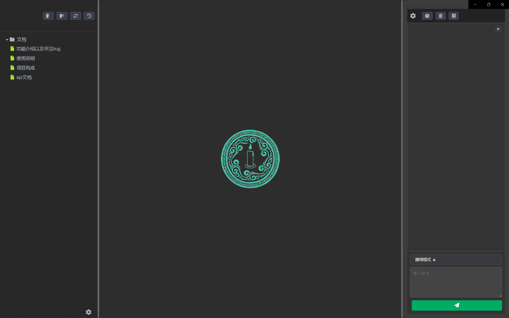

# Qingzhu v1.0.0

[中文版](README.md) | English Version


## Project Introduction

Qingzhu (Official Name) is a desktop application built on the Electron framework, aiming to provide users with an AI-assisted novel creation platform.

**Core Features**:
*   **AI Smart Interaction**: Real-time conversation with AI, from providing inspiration to content writing, revision and polishing, intelligent assistance throughout the entire writing process.
*   **Chapter Management**: Users/AI can intuitively create, edit, delete, and organize novel chapters, clearly presenting the work's structure.
*   **Content Editor**: Provides a basic text editing interface, supporting the writing and modification of novel content.
*   **Writing Style Imitation**: Based on RAG technology, analyzes text fragments and imitates writing styles.
*   **Tool Calling**: Supports calling tools to solve problems, similar to vibecoding.

## Technology Stack

*   **Electron**: Used to build cross-platform desktop applications, combining web technologies (HTML, CSS, JavaScript) with native capabilities.
*   **React.js**: Frontend user interface framework, providing efficient component-based development patterns and excellent user experience.
*   **Node.js**: Backend service runtime environment, responsible for handling AI interactions, file system operations, and IPC communication with the frontend.
*   **AI API Integration**: Currently supports unified integration of DeepSeek-v3 and DeepSeek-r1 model APIs, with experimental support for local Ollama models (with significant adaptation issues).
*   **ChromaDB**: Open-source vector database for RAG (Retrieval-Augmented Generation) functionality, providing semantic search and knowledge base management.
*   **Redux**: Frontend state management library, used to uniformly manage the application's complex state.
*   **Tiptap**: Excellent rich text editor.
*   **electron-store**: Lightweight Electron configuration storage library, used to persist application settings, such as API Key.


## Quick Start

### Environmental Requirements
#### Windows 11 Operating System √
*   Node.js (v20.19.4 tested)
*   npm or yarn (npm 11.6.0 tested)
*   Python 3.8+ (3.12.3 tested)
*   windows_build_tools (Microsoft Visual C++ Build Tools 2022 can be used)

### Installation

1.  **Clone the repository**:
    ```bash
    git clone https://github.com/18643751823/ai-novelist
    cd ai-novelist
    ```

2.  **Install Python packages**:
    Ensure Python 3.8+ is installed, then install ChromaDB:
    ```bash
    pip install chromadb
    ```

3.  **Install project dependencies**:
    Execute in the project root directory (ai-novelist/)
    ```bash
    npm install
    ```
    Go to the front-end directory
    ```bash
    cd frontend/react-app
    ```
    Install dependencies
    ```bash
    npm install
    cd ../..
    ```
4.  **Building Backend and Frontend**:
    The project's backend and frontend components were then built using the provided npm scripts.
    ```bash
    npm run build:backend
    npm run build:react
    ```
### Running the Application

**Start Electron application**:
Execute in the project root directory (`ai-novelist/`):
```bash
npm run start:full .
```

The application will automatically start the ChromaDB server (listening on port 8000). If port 8000 is occupied, the application will automatically try other ports.

**Note**: On first run, ChromaDB needs some time to initialize the database.

**Configure API Key**:
After the application starts, you need to enter your DeepSeek API Key in the application's settings interface. This API Key will be securely stored via `electron-store`.


## Contribution Rules
- All code commits must include a `Signed-off-by` line (in compliance with [DCO](https://developercertificate.org/)).
- Contributors confirm that their code is licensed under the [MIT License](LICENSE).
- All code must be original or compatible with the MIT License, without additional restrictions.
- Introduction of code with incompatible licenses such as GPL/AGPL is prohibited.

We welcome and thank all contributors! If you have any bug reports, feature suggestions, or wish to submit code, please feel free to contact us via GitHub Issues or Pull Requests.

## License

This project uses the [MIT License](LICENSE).


---

## Acknowledgements

This project's development has been heavily inspired by the `roo-code` project. We extend our sincere gratitude to the developers of `roo-code`.

The `roo-code` project is licensed under the Apache License 2.0. In compliance with its terms, we have included the original license notice within our project, which can be found in the [`LICENSE-roo-code.txt`](./LICENSE-roo-code.txt) file.
