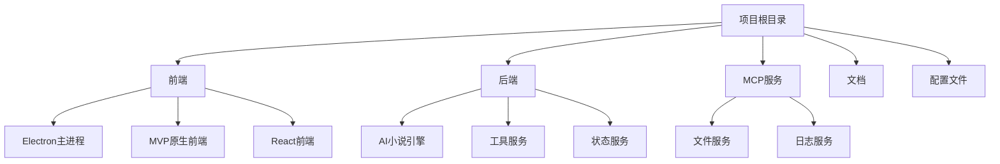
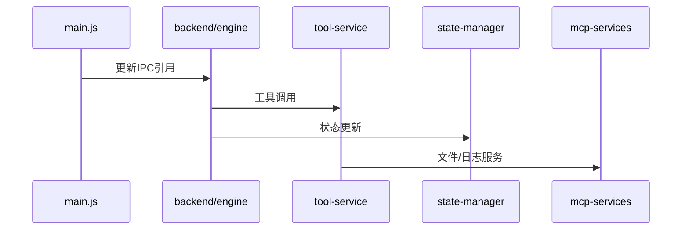

# AI Novelist MVP 重构迁移计划

## 目录结构调整方案


## 代码迁移步骤

### 第一阶段：目录创建与基础迁移
```bash
# 创建核心目录结构
mkdir frontend backend mcp-services docs

# 迁移前端资源
mv ai-novelist-mvp frontend/mvp
mv ai-novelist-react frontend/react

# 迁移后端核心
mkdir backend/engine
mv ai-novelist-mvp/ipc backend/engine/
mv ai-novelist-mvp/api backend/engine/

# 迁移服务模块
mkdir backend/tool-service
mv ai-novelist-mvp/tools backend/tool-service/
mkdir backend/state-manager
mv ai-novelist-mvp/managers backend/state-manager/
```

### 第二阶段：依赖更新


### 第三阶段：服务接口适配
创建服务注册中心：
```javascript
// backend/service-registry.js
module.exports = {
  toolService: require('./tool-service'),
  stateService: require('./state-manager'),
  engine: require('./engine')
};
```

## 验证测试方案
1. **单元测试**
   ```bash
   # 引擎核心测试
   cd backend/engine
   npm test
   
   # 工具服务测试
   cd ../tool-service
   npm test
   ```

2. **集成测试**
   ```mermaid
   graph LR
    用户指令-->引擎
    引擎-->工具服务
    工具服务-->文件操作
    文件操作-->结果返回
    结果返回-->用户界面
   ```

3. **端到端测试**
   - 启动Electron主进程
   - 执行完整小说生成流程
   - 验证工具调用链

## 实施时间表
| 阶段 | 预计时间 | 负责人 |
|------|----------|--------|
| 目录迁移 | 1天 | 开发团队 |
| 依赖更新 | 2天 | 后端工程师 |
| 接口适配 | 1天 | 全栈工程师 |
| 测试验证 | 2天 | QA团队 |
| 上线部署 | 0.5天 | DevOps |