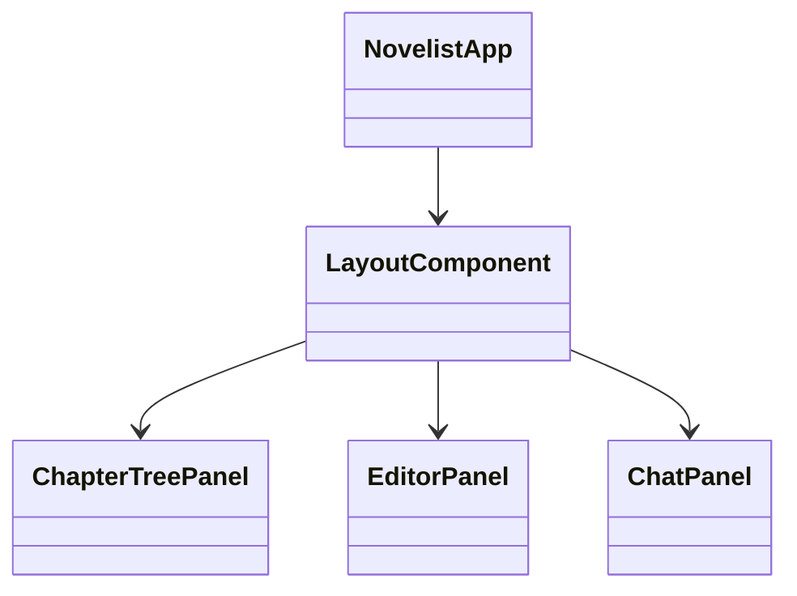
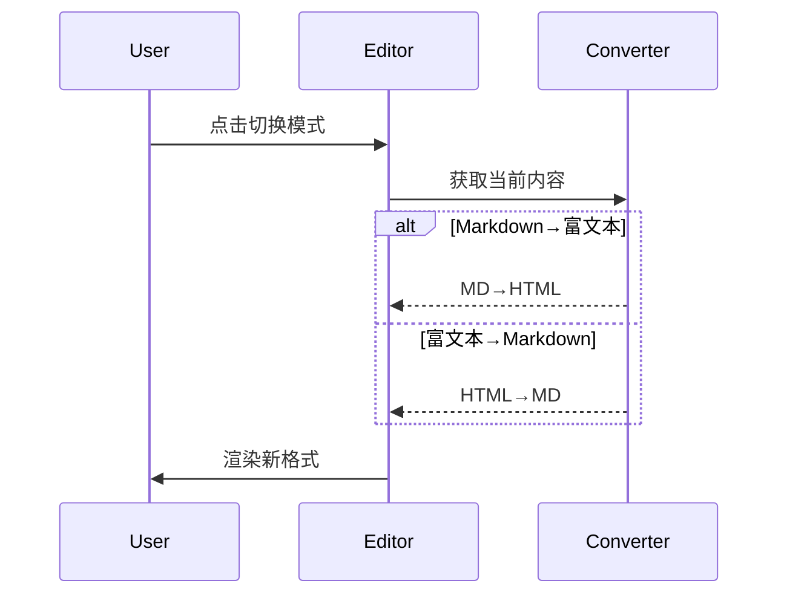
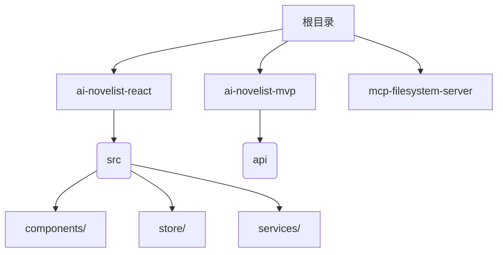

首先，我们需要明确的是：mvp实现了什么内容
然后，对比完整项目，确定哪些板块需要演进
最后，确定开发计划，目前确定为前端驱动后端开发。

首先，mvp实现的是
1. ai小说家的基础功能，包括文件创建、读取和写入（与创建使用的工具相同）操作，
2. 一个极简的用户界面，用于小说写作，与ai小说家交互。
3. 基本的存储逻辑

然后，需要演进的板块有：
# 1. 用户和ai的完整交互闭环（已经完成）：

    1.  **用户在 UI 聊天框输入自然语言指令。** (例如: `帮我新建一个名为“我的第一章”的文件`)（完成）
    2.  **Electron 前端通过 IPC 将用户的自然语言指令发送给 Node.js 后端。**（完成）
    3.  **Node.js 后端（`main.js`）将用户指令连同预定义的 MCP 工具描述发送给 AI 大模型（DeepSeek）。**（完成）
    4.  **AI 大模型根据用户指令和工具描述，判断是否需要调用工具，并返回信息。信息应该包含：1对用户要求的分析与回复，2如果有调用工具的需求，则先分析使用工具的先后顺序，然后在分析的末尾输出工具调用指令（例如 `{"tool_name": "write_file", "parameters": {"path": "我的第一章.txt"}}`）或纯文本回复。**（完成）
    5.  **Node.js 后端接收 AI 大模型的响应。**（完成）
    *   如果响应包含文本和工具调用指令，Node.js 后端解析指令，提取工具名称和参数。并将文本返回前端，在前端显示文本和调用的工具名称，供用户观察和确认/取消执行。（完成）
    *   如果响应是纯文本回复，Node.js 后端将该回复通过 IPC 返回给前端 UI 显示（完成）
    *   如果工具调用指令不正确，node,js还会把错误信息发给大模型。（完成）
    6.  **用户确认执行后，Node.js 后端根据解析出的工具名称和参数，构建并向 `mcp-filesystem-server` 发送 HTTP 请求。** (例如：向 `http://localhost:端口号/write_file` 发送 POST 请求，包含 `path: "我的第一章.txt"`)如果用户取消执行，则node.js将“取消执行”的信息作为上下文，以system角色发送给DeepSeek，让AI进行下一步操作。（完成）
    7.  **`mcp-filesystem-server` 接收 HTTP 请求，执行相应的操作（例如，创建 `D:\ai小说家\我的第一章.txt` 空文件）。**
    8.  **`mcp-filesystem-server` 将操作结果（例如：成功/失败消息）通过 HTTP 响应返回给 Node.js 后端。**（完成）
    9.  **Node.js 后端接收 `mcp-filesystem-server` 的 HTTP 响应，处理操作结果。**（完成）
    *   Node.js 后端将操作结果通过 IPC 发送回前端，告知用户操作成功/失败。（完成）
    *   Node.js 后端将操作结果作为上下文存储，以 `tool` 角色发送，目的是让大模型得知工具执行情况，并进行下一步操作。 
    10. **前端在聊天框中显示“文件创建成功”或失败消息。**（完成）
    11. **当大模型认为用户此次操作已经完成后，将使用一个结束工具终结此次工具调用任务，后端解析到这个结束工具调用指令，将把除了调用函数外的纯文本信息发送给前端，前端将显示这些文本，以告知用户操作已经完成。同时还会发送一个结束信号，告知前端此次多轮工具调用已经结束，前端会渲染此次的文本为绿色，以区别于之前的文本。用户还可以设置响铃提醒，以提醒用户操作已经完成。**(完成)
    12. **用户继续输入新的指令，则重复上述步骤。并将历史消息作为上下文，连同系统和用户的各种promrt或者工具调用说明，一并发送给大模型，实现多轮对话**（完成）
    13. **中途，如果ai认为用户的指令不够清晰，可以调用工具反问用户，可以提供可选多个答案，让用户选择一个答案，然后根据选择的答案，进行下一步操作，用户也可以不选择答案，并自由回复。**（完成）

    
# 2. 前端UI的演进（驱动后端演进）：
    1.  需要模仿市面上已经有的ai小说/编程工具，仿照它们设计一个高效的UI布局。
    2.  需要市场调研，以及研究一本小说的写作流程和生命周期，设计具体的UI组件和对应功能。
    3.  需要考虑用户个性化，增加尽可能多的个性化设置板块。
    4.  支持回溯功能。

# 3. 后端逻辑的演进：
    1.  根据前端的UI以及功能设计，在后端编写对应的逻辑，实现对应功能。
    2.  优化大模型的通信，增加总结模块减少噪音，节省tokens，提升响应速度。
    3.  分化大模型的使用，实现多种模式的大模型，prompt和的工具调用各不相同，各有所长。
    4.  增加大模型的支持数量，主流大模型都需要支持。
    4.  增加本地大模型，内嵌大模型。支持大模型操纵前端，实现真正的ai软件。让软件彻底活过来。
    5.  升级协议，兼容mcp协议，适配用户的定制化需求。而且大模型还能根据api文档，自己制作mcp。
    6.  数据结构与文件存储的优化？？？


项目开发的实际过程/计划：
---
# 第一阶段,构建mvp产品，并重构主程序
略
# 第二阶段，前端重构（完成）+升级。同时驱动后端重构（完成）/升级

## 技术选型
| 领域 | 技术方案 | 许可证 | 优势 |
|------|----------|--------|------|
| 框架 | React 18 + TypeScript | MIT | 组件化/类型安全 |
| 状态管理 | Redux Toolkit | MIT | 可预测状态管理 |
| 编辑器 | Monaco + Tiptap | MIT | 双模式支持 |
| 格式转换 | Turndown + Marked.js | MIT | Markdown/HTML互转 |

## 组件架构


## 实施阶段
1. **基础架构搭建 (1周)**
   - React+TS项目初始化
   - Redux状态管理配置
   - IPC通信服务封装

2. **核心组件迁移 (2周)**
   - 章节目录树组件
   - 双模式编辑器组件
   - 聊天交互组件

3. **状态管理重构 (1周)**
   - novelState切片（文件/内容）
   - chatState切片（消息历史）
   - toolState切片（工具建议）

4. **UI/UX优化 (1周)**
   - 响应式三栏布局
   - 编辑器模式切换
   - 执行状态可视化

## 双模式编辑器方案

## 详细实施计划

### 文件结构优化方案


### 开发计划
```mermaid
gantt
    title 前端重构实施计划
    dateFormat  YYYY-MM-DD
    section 核心功能
    三栏布局组件        ：2025-05-31, 2d
    章节目录树组件      ：2025-06-02, 3d
    双模式编辑器集成    ：2025-06-05, 4d
    section 状态管理
    连接Redux Store    ：2025-05-31, 1d
    实现状态持久化      ：2025-06-01, 2d
    section IPC通信
    完善ipcService     ：2025-06-03, 2d
    对接现有MVP后端    ：2025-06-05, 3d
```

### 具体实施步骤
1. **创建布局组件**：实现三栏布局容器
2. **完善状态管理**：定义Redux切片初始状态
3. **集成编辑器**：安装monaco-editor+tiptap依赖
4. **连接IPC服务**：封装与ai-novelist-mvp的通信

### 需要补充的文件
- `src/components/Layout/index.tsx`
- `src/componentsTree/indexTree/index.tsx`
- `src/components/Editor/index.tsx`
- `src/components/Chat/index.tsx`
- `src/App.tsx`


# 第三阶段，发布beta产品，重构项目文件结构，让文件结构更加清晰，便于维护和扩展。
......