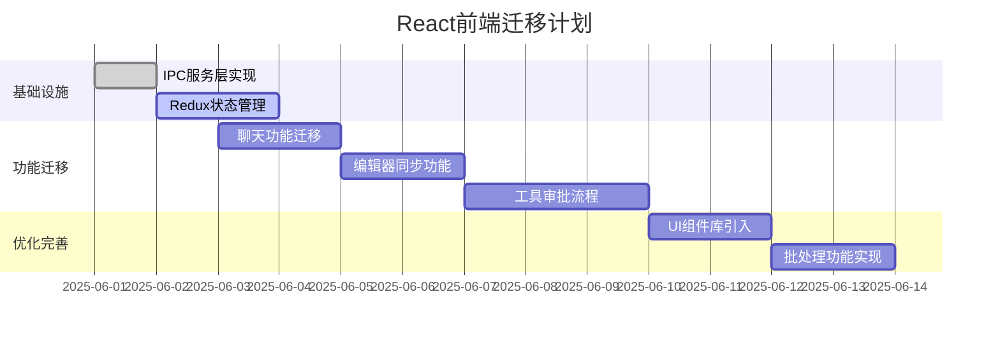

# AI小说家前端React迁移计划

## 当前状态分析
- DOM前端(mvp/)功能完整但维护困难
- React前端(react/)仅有基础框架，缺少核心功能
- 需要保留的功能：
  - 实时聊天通信
  - 工具建议审批(单个/批量)
  - 小说内容编辑与同步
  - IPC通信层

## 迁移路线图



## 详细实施步骤

### 1. IPC服务层实现
- 创建`ipcService.ts`核心服务
- 封装主进程通信接口：
  ```typescript
  interface IPCService {
    sendCommand(command: string): Promise<void>
    onAIResponse(callback: (response: AIResponse) => void): void
    processToolAction(toolId: string, action: 'approve'|'reject'): Promise<void>
  }
  ```

### 2. Redux状态管理
- 完善核心slices：
  - `chatSlice`: 管理聊天消息、提问状态
  - `novelSlice`: 管理小说内容、当前章节
  - `toolsSlice`: 管理工具建议及审批状态

### 3. 功能组件迁移
- **聊天功能**:
  - 实现消息收发组件
  - 添加用户提问交互卡片
  - 支持消息历史记录

- **编辑器**:
  - 自动保存与同步
  - 章节切换功能
  - 多人协作支持

- **工具审批**:
  - 单个工具卡片组件
  - 批量操作面板
  - 状态反馈机制

## 后续优化
1. 引入Ant Design组件库统一UI风格
2. 添加批处理操作历史记录
3. 实现离线编辑功能
4. 性能优化(虚拟滚动等)