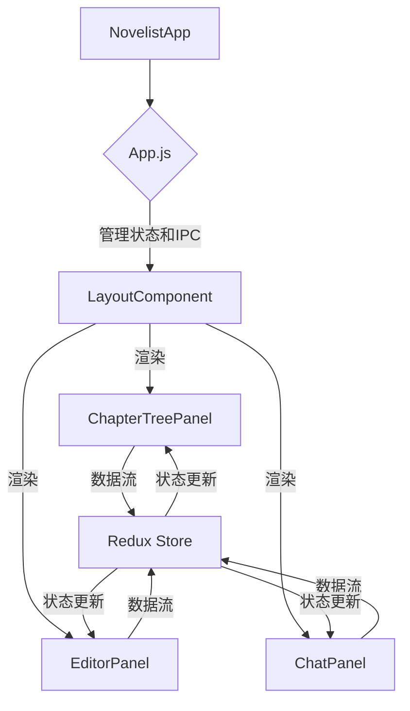

# 前端UI布局改造计划

## 核心目标
1. 实现一个仿VSCode的左中右三栏布局（2:6:2比例），支持用户拖动调整分界线和折叠左右栏。
2. 将每个栏的基本功能完全实现

## 技术选型回顾
*   **框架：** 沿用 React 18 + TypeScript
*   **状态管理：** 引入 Redux Toolkit
*   **编辑器：** 引入 Monaco + Tiptap
*   **格式转换：** 引入 Turndown + Marked.js

## 详细计划步骤

1.  **引入布局库：**
    *   为了实现三栏布局、支持拖动调整比例和折叠左右栏，我们将引入 `react-resizable-panels` 这个库。它能很好地满足这些需求。
    *   需要安装该库及其相关依赖。

2.  **创建核心布局组件 `LayoutComponent`：**
    *   在 `src/components` 目录下创建一个新的文件，例如 `LayoutComponent.js` (或 `.tsx`)。
    *   `LayoutComponent` 将作为应用程序的主要布局容器，使用 `react-resizable-panels` 来构建左、中、右三个可调整大小的面板。
    *   初始比例将设置为 2:6:2，并确保拖动功能正常工作。

3.  **拆分 `App.js` 中的现有UI到新组件：**

    *   **`ChapterTreePanel` (左侧面板):**
        *   在 `src/components` 目录下创建 `ChapterTreePanel.js`。
        *   这部分UI在现有 `App.js` 中不存在，需要全新实现。
        *   它将负责展示小说章节列表（可折叠树形结构）和文件信息。
        *   功能包括新建、删除、重命名、章节排序等。
        *   交互上，点击章节应能加载内容到中间的编辑区。
        *   需要与主进程进行IPC通信，以获取和管理章节数据。
        *   可以考虑使用 Ant Design 或 Material-UI 的树形组件来构建章节列表。

    *   **`EditorPanel` (中间面板):**
        *   在 `src/components` 目录下创建 `EditorPanel.js`。
        *   将 `App.js` 中当前用于显示 `novelContent` 的 `textarea` 迁移到此组件。
        *   我们会在这里集成 **Monaco Editor** 或 **Tiptap** 作为专业的小说正文编辑器，替换现有的简单 `textarea`。
        *   负责处理小说内容的显示和编辑，并将更改同步回应用程序状态。

    *   **`ChatPanel` (右侧面板):**
        *   在 `src/components` 目录下创建 `ChatPanel.js`。
        *   将 `App.js` 中当前的 AI 聊天显示区 (`chatDisplay`)、工具建议、AI 提问卡片以及聊天输入框 (`chatInput`) 和发送按钮全部迁移到此组件。
        *   对聊天消息的渲染进行重构，使其视觉效果更接近主流聊天应用。
        *   处理用户输入指令、显示对话历史（用户提问和AI回复）。
        *   如果AI输出包含富文本或Markdown，将引入 **Marked.js** 进行渲染。
        *   负责 `handleSendMessage`, `handleToolAction`, `handleBatchAction`, `handleUserQuestionResponse` 等所有与AI交互相关的逻辑。

4.  **重构 `App.js`：**
    *   `App.js` 将变得更加精简和专注于核心职责。
    *   它将主要负责整个应用程序的顶层状态管理（例如：`messages`, `novelContent`, `currentFile` 等）以及与Electron主进程的IPC通信。
    *   `App` 组件将只渲染 `LayoutComponent`，并通过props将必要的数据和回调函数传递给 `LayoutComponent`，由 `LayoutComponent` 再分发给其内部的子组件。
    *   确保所有IPC监听和发送逻辑仍然在 `App.js` 或一个更高层次的上下文提供者（如Redux Provider）中，以便所有子组件都能访问。

5.  **引入Redux Toolkit进行状态管理：**
    *   为了更好地管理应用程序的复杂状态，我们将引入 Redux Toolkit。
    *   创建 Redux store，并将目前的 `App.js` 中由 `useState` 管理的全局状态（如 `messages`, `novelContent`, `toolSuggestions`, `questionCard`）迁移到 Redux store 中。
    *   各个组件将通过 Redux 的 `useSelector` 和 `useDispatch` Hook 来访问和修改共享状态，确保数据流的清晰和可预测性。

6.  **CSS调整：**
    *   将更新 `App.css` 或创建新的CSS模块/CSS-in-JS方案来支持新的三栏布局和各个组件的样式。
    *   确保最终的UI样式与VSCode的设计风格保持一致，并具备良好的响应式能力。

## 建议的文件结构
为了更好地组织代码，我们将采用以下文件结构：
```
frontend/react-app/
├── src/
│   ├── App.js                 // 根组件，处理IPC和Redux Store配置
│   ├── App.css
│   ├── index.js
│   ├── index.css
│   ├── hooks/
│   │   └── useIpcRenderer.js  // 自定义IPC Hook
│   ├── components/            // UI组件目录
│   │   ├── LayoutComponent.js     // 主要布局组件
│   │   ├── ChapterTreePanel.js    // 左侧章节/文件面板
│   │   ├── EditorPanel.js         // 中间编辑器面板
│   │   ├── ChatPanel.js           // 右侧聊天面板
│   │   └── ... (其他小的UI组件，如消息卡片、工具卡片等)
│   ├── store/                 // Redux store配置和slices
│   │   ├── index.js           // Redux store初始化
│   │   └── slices/
│   │       ├── chatSlice.js       // 管理聊天消息和AI交互状态
│   │       ├── novelSlice.js      // 管理小说内容和章节状态
│   │       └── uiSlice.js         // 管理UI相关的状态，如面板折叠状态
│   ├── utils/                 // 工具函数目录
│   │   └── ... (如Markdown渲染函数)
└── ...
```

## 新的组件架构图


## 实现顺序（建议）
1.  首先安装 `react-resizable-panels`。
2.  然后，创建 `LayoutComponent` 并初步实现三栏布局，将 `App.js` 中现有的小说内容 `textarea` 和聊天部分暂时性地移动到 `LayoutComponent` 中的相应区域，以快速验证基础布局是否正常工作。
3.  接着，逐步将 `App.js` 中的逻辑和UI拆分到新的组件中，并同时引入 Redux 进行状态管理。
4.  之后，可以开始集成 Monaco/Tiptap 编辑器。
5.  最后，逐步实现左侧的章节/文件管理功能。